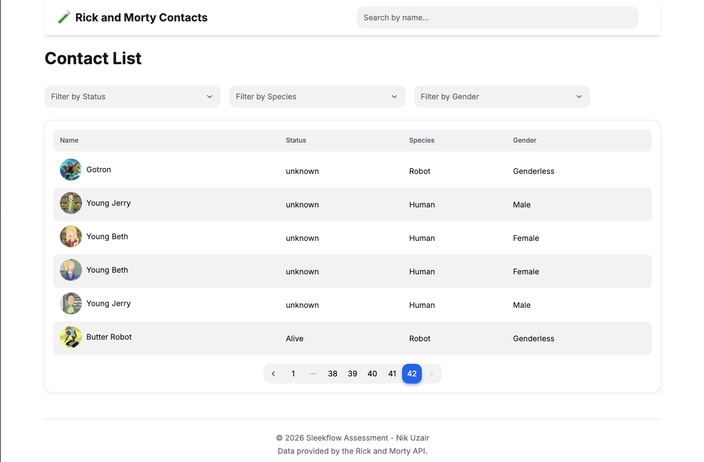
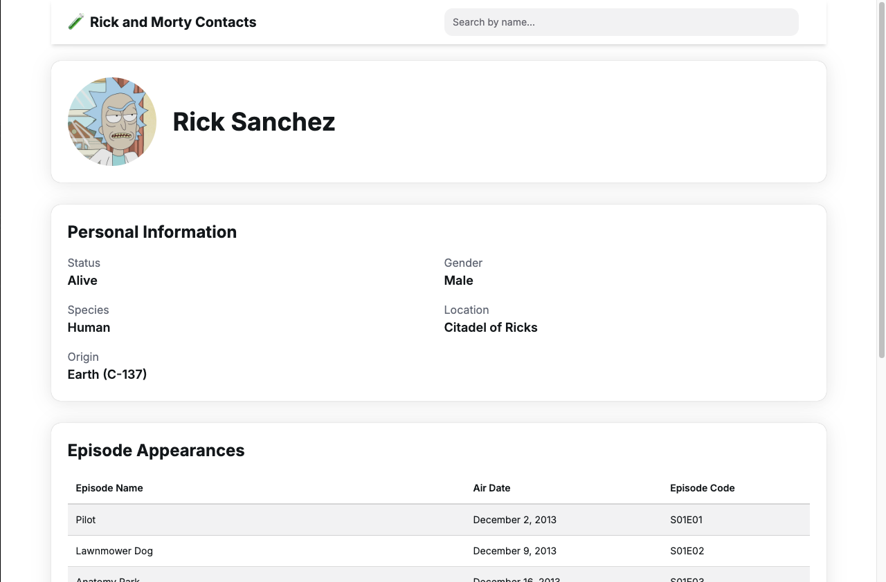
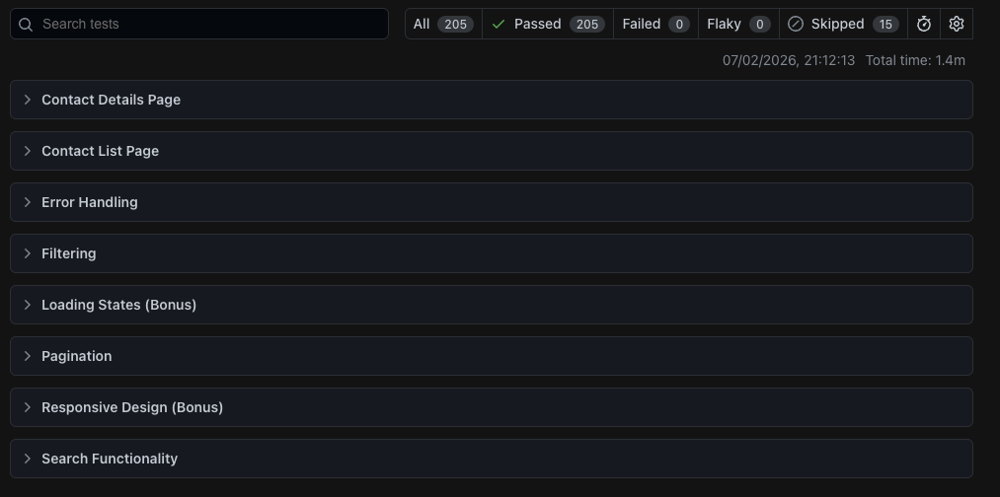
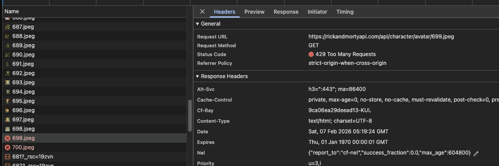
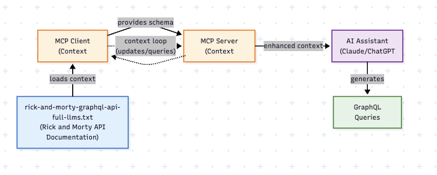

# Rick and Morty Contact List

https://sleekflow-fe-assessment.vercel.app/

A contact management application that displays characters from the Rick and Morty universe. Built as a CRM-style interface where users can browse, search, and filter characters, then view detailed information about each one including their episode appearances.

---

## Screenshots

<p>
  
  
</p>

## Performance Metrics


> **Disclaimer:** Lighthouse tests were run in production & Chrome Incognito mode.

## E2E Testing Coverage



Covering a comprehensive testing suite with **44+** test cases across 5 browsers, resulting in ~220 total scenarios

---

## Table of Contents

- [What This Application Does](#what-this-application-does)
- [Technical Architecture](#technical-architecture)
  - [Stack](#stack)
  - [Caching Strategy](#caching-strategy)
  - [Routes](#routes)
- [Project Structure](#project-structure)
- [Testing](#testing)
- [SEO Optimization](#seo-optimization)
- [Trade-off Analysis](#trade-off-analysis)
- [AI Usage & My Contributions](#ai-usage--my-contributions)
  - [Parts I Personally Designed & Wrote](#parts-i-personally-designed--wrote)
  - [Parts Heavily AI-Generated & Edited](#which-parts-were-heavily-ai-generated-and-then-edited-by-me)
  - [What AI Output I Rejected](#what-ai-output-i-rejected--why)
  - [My Hardest Decision](#my-hardest-decision)
  - [Model Context Protocol (MCP)](#model-context-protocol-mcp)
- [Resources](#resources)

---

## What This Application Does

I built this application as a contact management feature for a CRM system, using the Rick and Morty API as the data source. The core user story was simple:

> **"As a user, I want to see my list of contacts and view their related information."**

This is a full-stack Next.js application that demonstrates how I approach real-world CRM requirements while maintaining code quality, performance, and user experience.

**Core Features (Per Requirements):**

- **Contact List Table** - Display up to 20 contacts with name, status, species, and gender
- **Name Search** - Search contacts by character name with instant filtering
- **Multi-Field Filtering** - Filter by status, species, and gender with URL persistence
- **Persistent State** - Filters and search survive page refreshes via URL parameters
- **Contact Details** - Dedicated pages (`/contact/:id`) showing:
  - Header with contact image and name
  - Personal info (Status, Gender, Species, Location, Origin)
  - Episode appearances table (Name, Air Date, Episode code)
- **Pagination** - Navigate through multiple pages of contacts
- **SEO Optimized** - Custom metadata for all pages

**Bonus Features Implemented:**

- **SEO Optimization** - Implemented comprehensive SEO metatags across all pages:
  - Contact List Page: `"Contact List - SleekFlow"` with descriptive metadata
  - Individual Contact Pages: `Dynamic "{Contact Name} | SleekFlow"` titles with personalized descriptions
- **Contact List Pagination** - Full pagination support with:
  - Navigate through multiple pages of contacts
  - URL-based page state for shareable links

**Technical Enhancements I Added:**

- **GraphQL Migration** - Reduced API payload by 60-80% (from REST baseline)
- **Smart Caching** - 1-hour revalidation strategy for better performance
- **Responsive Design** - Works seamlessly on mobile, tablet, and desktop
- **E2E Testing** - 44 Playwright E2E tests across 5 browsers
- **Accessibility** - Semantic HTML and proper ARIA labels

I intentionally did not prioritize custom UI/UX design. Instead, I used the HeroUI component library for consistency and efficiency, allowing me to focus on architecture, data handling, and performance.

## Technical Architecture

### Stack

I chose this tech stack carefully to balance performance, developer experience, and modern best practices:

| Category           | Technology / Tool                                  |
| ------------------ | -------------------------------------------------- |
| Frontend Framework | Next.js 14 (App Router)                            |
| Language           | TypeScript                                         |
| Styling            | Tailwind CSS                                       |
| UI Components      | HeroUI                                             |
| Data Fetching      | GraphQL (graphql-request) & REST API (alternative) |
| Animation          | Framer Motion                                      |
| Testing            | Playwright                                         |
| Code Quality       | ESLint, Prettier                                   |
| Deployment         | Vercel                                             |

**Why These Choices?**

- **GraphQL over REST**: This was a game-changer. The REST API returns 21 fields per character, but I only needed 6 for the list view. With GraphQL, I reduced the payload size by 60-80%, which significantly improved load times. I documented this migration in [`graphql-migration.md`](docs/graphql-migration.md).

- **Tailwind CSS**: Utility-first CSS keeps my components clean and makes responsive design much easier to implement.

- **Playwright**: I needed robust E2E testing that works across multiple browsers. Playwright gives me that with excellent developer experience.

### Caching Strategy

I implemented a multi-layered caching approach to optimize performance and reduce unnecessary API calls:

#### 1. **Next.js Data Cache (Primary Layer)**

```typescript
// src/queries/contacts-graphql.ts
export async function fetchCharactersContactList(params: FetchParams) {
  return graphqlClient.request(GET_CHARACTERS_QUERY, variables, {
    next: {
      revalidate: 3600, // 1 hour cache
      tags: ['characters-list'],
    },
  });
}
```

**Why 1 hour?** The Rick and Morty data is relatively static - characters don't change frequently. This strikes a balance between freshness and performance. Users get instant page loads from the cache while still receiving updates within a reasonable timeframe.

#### 2. **HTTP Response Caching**

```typescript
// src/app/contact/[id]/page.tsx
export const revalidate = 3600; // Cache page for 1 hour
export const dynamic = 'force-static'; // Pre-render at build time where possible
```

I use different caching strategies depending on the page:

- **Static pages** (contact details): Pre-rendered at build time, revalidated hourly
- **Dynamic pages** (search results): Rendered on-demand but cached for subsequent requests
- **URL-based filtering**: Leverages Next.js automatic request memoization

#### 3. **Image Optimization**

```javascript
// next.config.mjs
images: {
  remotePatterns: [{
    protocol: 'https',
    hostname: 'rickandmortyapi.com',
    pathname: '/api/character/avatar/**',
  }],
}
```

Next.js automatically optimizes and caches character avatars, serving them in modern formats like WebP with appropriate sizes for different devices.

**Benefits of This Approach:**

- **Instant Navigation**: Most page transitions are near-instantaneous due to cached data
- **Reduced API Costs**: Fewer requests to the GraphQL endpoint
- **Better UX**: Users don't see loading spinners for previously visited content
- **Fresh When Needed**: On-demand revalidation ensures data stays current

### Routes

I structured the routing to be intuitive and SEO-friendly. Here's how the application is organized:

```
/                           → Contact list (homepage)
  ├── ?page=2              → Pagination
  ├── ?name=rick           → Search filter
  ├── ?status=alive        → Status filter
  ├── ?species=human       → Species filter
  └── ?gender=male         → Gender filter

/contact/[id]              → Character detail page
  ├── /contact/1          → Rick Sanchez
  └── /contact/999        → 404 (invalid ID)

/search                    → Search results page
  └── ?name=morty         → Search query
```

**Routing Decisions:**

1. **Query Parameters Over Client State**: I use URL query parameters for all filters and search. This gives users shareable URLs and makes the back button work naturally.

2. **Dynamic Routes for Details**: The `[id]` pattern gives us clean URLs and enables static generation for popular characters.

3. **Dedicated Search Route**: While search works from anywhere, I have a dedicated `/search` page for better UX and clearer intent.

4. **Type-Safe Routing**: I created a central `paths.ts` helper to ensure all route generation is type-safe:

```typescript
// src/paths.ts
const paths = {
  home() {
    return '/';
  },
  contactShow(id: string) {
    return `/contact/${id}`;
  },
};
```

---

## Project Structure

I organized the codebase for scalability and maintainability. Here's how everything is structured:

```
sleekflow_fe_assessment/
│
├── Configuration Files
│   ├── next.config.mjs              # Next.js configuration
│   ├── tailwind.config.ts           # Tailwind CSS customization
│   ├── tsconfig.json                # TypeScript settings
│   ├── playwright.config.ts         # Playwright test configuration
│   └── package.json                 # Dependencies and scripts
│
├── src/                          # Source code
│   ├── app/                         # Next.js App Router pages
│   │   ├── layout.tsx              # Root layout with header/footer
│   │   ├── page.tsx                # Homepage (contact list)
│   │   ├── error.tsx               # Global error boundary
│   │   ├── not-found.tsx           # 404 page
│   │   ├── globals.css             # Global styles
│   │   │
│   │   ├── contact/[id]/           # Dynamic contact detail pages
│   │   │   ├── page.tsx           # Contact detail page
│   │   │   ├── error.tsx          # Contact-specific error handling
│   │   │   └── not-found.tsx      # Contact 404 page
│   │   │
│   │   ├── search/                 # Search results page
│   │   │   └── page.tsx
│   │   │
│   │   └── constants/              # App-level constants
│   │       ├── api.ts             # API endpoints & cache config
│   │       └── filters.ts         # Filter options
│   │
│   ├── components/                 # React components
│   │   ├── common/                # Shared components
│   │   │   ├── header.tsx
│   │   │   ├── footer.tsx
│   │   │   ├── loading.tsx
│   │   │   └── search-input.tsx
│   │   │
│   │   ├── contacts/              # Contact list components
│   │   │   ├── contact-list.tsx
│   │   │   ├── contact-pagination.tsx
│   │   │   └── filter-toolbar.tsx
│   │   │
│   │   └── contact-details/       # Contact detail components
│   │       ├── contact-header.tsx
│   │       ├── personal-info.tsx
│   │       ├── episode-list.tsx
│   │       └── *-skeleton.tsx     # Loading skeletons
│   │
│   ├── queries/                    # Data fetching logic
│   │   ├── contacts-graphql.ts    # GraphQL queries (active)
│   │   └── contacts-res.old.ts    # Old REST implementation (reference)
│   │
│   ├── contexts/                   # React Context providers
│   │   └── providers.tsx          # UI theme provider
│   │
│   ├── utils/                      # Utility functions
│   │   └── url.ts                 # URL manipulation helpers
│   │
│   ├── constants/                  # Global constants
│   │   └── api.ts                 # API configuration
│   │
│   ├── graphql-client.ts          # GraphQL client setup
│   └── paths.ts                    # Type-safe route definitions
│
├── e2e/                         # End-to-end tests
│   ├── contact-list.spec.ts       # List page tests
│   ├── contact-details.spec.ts    # Detail page tests
│   ├── search.spec.ts             # Search functionality tests
│   ├── filtering.spec.ts          # Filter tests
│   ├── pagination.spec.ts         # Pagination tests
│   ├── error-handling.spec.ts     # Error scenario tests
│   ├── responsive-design.spec.ts  # Mobile/tablet tests
│   ├── loading-states.spec.ts     # Loading UI tests
│   ├── graphql-bonus.spec.ts      # GraphQL integration tests
│   └── README.md                   # Test documentation
│
├── docs/                        # Documentation
│   ├── onboard.md                 # Developer onboarding guide
│   ├── e2e-testing.md             # E2E testing documentation
│   ├── graphql-migration.md       # GraphQL migration guide
│   ├── screenshots/               # Images for README
│   └── rick-and-morty-graphql-api-full-llms.txt  # API docs for MCP
│
└── Build Outputs
    ├── .next/                     # Next.js build cache
    ├── playwright-report/         # Test results
    └── test-results/              # Test artifacts
```

**Organizational Principles:**

1. **Feature-Based Components**: I group components by feature (contacts, contact-details) rather than by type. This makes it easier to locate related code.

2. **Colocation**: I keep route-specific components close to their routes when they're not reusable.

3. **Clear Separation**: Data fetching (`queries/`), UI logic (`components/`), and routing (`app/`) are clearly separated.

4. **Test Isolation**: E2E tests are in a dedicated `e2e/` folder, making them easy to run independently.

## Testing

I built a comprehensive E2E testing suite with Playwright. Here's what's covered:

### Running Tests

```bash
# Run all tests (headless)
npm test

# Run with UI mode (recommended for development)
npm run test:ui

# View test report
npm run test:report
```

### Test Coverage

I wrote **44+ test cases** covering:

- ✅ Contact list rendering and navigation
- ✅ Contact details page functionality
- ✅ Search with URL persistence
- ✅ Multi-filter combinations
- ✅ Pagination with query parameters
- ✅ Error handling (404s, invalid data)
- ✅ Responsive design (mobile, tablet, desktop)
- ✅ Loading states and skeletons
- ✅ GraphQL integration verification

**Cross-Browser Testing:**
All tests run on 5 browsers: Chrome, Firefox, Safari, Mobile Chrome, and Mobile Safari (approximately **220 total test scenarios**).

For detailed testing documentation, see [`TESTING.md`](docs/e2e-testing.md).

---

## SEO Optimization

I implemented several SEO best practices to ensure the application is discoverable and performs well in search rankings:

### 1. **Metadata Management**

I implemented the exact SEO metadata requested in the bonus requirements:

**Contact List Page:**

```typescript
export const metadata: Metadata = {
  title: 'Contact List - SleekFlow',
  description: 'View our list of contacts with their related information.',
};
```

**Individual Contact Pages:**

```typescript
export async function generateMetadata({ params }): Promise<Metadata> {
  const character = await fetchCharacterById(params.id);

  return {
    title: `${character.name} | SleekFlow`,
    description: `View information about ${character.name}`,
  };
}
```

These metadata tags ensure proper display in search results and social media shares.

### 2. **Server-Side Rendering**

All pages are server-rendered by default, which means:

- ✅ Search engines can crawl the full content
- ✅ Users see content immediately (no loading spinners on first load)
- ✅ Better Core Web Vitals scores

### 3. **Semantic HTML**

I use proper HTML5 semantic elements:

```html
<header>
  ,
  <nav>
    ,
    <main>
      ,
      <article>
        ,
        <section>
          ,
          <footer></footer>
        </section>
      </article>
    </main>
  </nav>
</header>
```

### 4. **Image Optimization**

All character images use Next.js `<Image>` component with:

- Automatic WebP/AVIF conversion
- Lazy loading
- Proper `alt` text for accessibility
- Responsive sizing

### 5. **URL Structure**

Clean, descriptive URLs that are easy for both users and search engines:

```
Good: /contact/1
Bad:  /c?id=1&type=character
```

---

## Trade-off Analysis

Throughout this project, I made several architectural decisions that involved careful trade-off analysis. Here are the key considerations:

### 1. Contact List with Images

**Decision:** Display character images in the contact list table

**Trade-off Considerations:**

Displaying character images in the contact list creates a significantly better user experience by allowing users to visually identify contacts at a glance, which matches professional CRM patterns found in real-world applications. However, this decision comes with notable technical challenges. The primary issue is API rate limiting from the Rick and Morty API, which can cause requests to fail when loading multiple images simultaneously. Additionally, loading images for each contact increases the initial page load time and consumes more bandwidth, which could be problematic for users on slower connections or mobile devices. Despite these challenges, I chose to include images because the visual identification benefit is crucial for a modern CRM interface, and the technical problems could be solved with proper error handling and retry mechanisms.

**The Problem I Encountered:**



_API rate limit error when loading contact list with images_

**My Solution:**

I implemented a **retry mechanism with exponential backoff** to handle API rate limits gracefully:

```typescript
// Retry logic for rate-limited requests
const fetchWithRetry = async (url: string, retries = 3) => {
  for (let i = 0; i < retries; i++) {
    try {
      const response = await fetch(url);
      if (response.status === 429) {
        // Rate limited - wait and retry
        await new Promise((resolve) =>
          setTimeout(resolve, Math.pow(2, i) * 1000),
        );
        continue;
      }
      return response;
    } catch (error) {
      if (i === retries - 1) throw error;
    }
  }
};
```

**Video demonstration:** [`docs/screenshots/rate-limit-fix.mp4`](docs/screenshots/rate-limit-fix.mp4)

_Showing the retry mechanism handling rate limits automatically_

**Result:** Users experience seamless image loading even during high traffic, with automatic recovery from rate limit errors.

---

### 2. GraphQL vs REST

**Decision:** Migrate from REST to GraphQL mid-development

**Trade-off Considerations:**

The REST API returns all available fields for each character, which means significant over-fetching since the contact list only needs a subset of that data. The GraphQL approach allows me to request exactly the fields needed, resulting in substantially smaller payloads and faster page loads. However, migrating to GraphQL mid-development introduced several challenges. The REST implementation was already complete and working, so switching meant additional development time to learn the GraphQL client library, rewrite queries, and thoroughly test the new implementation. There was also the risk of introducing bugs during the migration. The learning curve for GraphQL was steeper than continuing with the familiar REST pattern, and I had to understand concepts like query composition, fragment usage, and proper error handling for GraphQL-specific issues. Despite these costs, I decided to proceed with GraphQL because the performance benefits were too significant to ignore. In a real-world CRM scenario where you might be loading hundreds or thousands of contacts, the payload reduction compounds dramatically. The smaller payloads mean faster load times, reduced bandwidth costs, and a better user experience especially on mobile networks. Additionally, GraphQL provides built-in type safety through its schema, which reduces the chance of runtime errors compared to manually typing REST responses. I kept the old REST implementation in the codebase as a reference point and documented the entire migration process to demonstrate my problem-solving approach.

**Reference:** See [`graphql-migration.md`](docs/graphql-migration.md) for detailed migration documentation.

---

### 3. API Call Overhead

**Decision:** Implement aggressive caching vs real-time data

**Trade-off Considerations:**

I had to balance between data freshness and API efficiency. Making a fresh API call on every page load would ensure users always see the latest data, but this approach quickly leads to API rate limiting issues, especially when multiple users access the application simultaneously or when a single user navigates between pages frequently. The constant API calls also result in slower page loads because the application must wait for the network request to complete before rendering content. On the opposite end of the spectrum, implementing infinite caching would provide the fastest possible page loads and eliminate all API overhead, but users would never see updated data without manually clearing their cache, which creates a poor user experience. I chose a middle ground by implementing a one-hour revalidation strategy, where Next.js caches the API responses and serves them from cache for subsequent requests within the time window. This approach dramatically reduces the number of API calls while still ensuring data stays reasonably fresh. For this particular application, character data from the Rick and Morty API is essentially static since the show's episodes are already released, making hourly updates more than sufficient. The caching strategy prevents rate limiting issues entirely under normal usage patterns, provides near-instant page loads for cached content, and maintains good data freshness for a use case where real-time updates aren't critical.

```typescript
export const revalidate = 3600; // 1 hour cache
```

---

### 4. URL Params vs Client State for Filters

**Decision:** Use URL query parameters instead of React state (useState)

**Trade-off Considerations:**

Using React's useState for filter management would have been significantly simpler to implement, requiring just a few lines of code to track filter values and update the UI accordingly. However, this approach has fundamental limitations that impact user experience. When filters are stored only in component state, users cannot share specific filtered views with others, the browser's back button doesn't work intuitively because it doesn't preserve filter selections, and refreshing the page resets all filters to their defaults. Additionally, client-side state is invisible to search engines, meaning each filter combination cannot be indexed separately, and there's no way for users to bookmark or deep-link to specific filtered states. In contrast, storing filter state in URL query parameters makes the implementation more complex because I need to handle URL parsing, parameter serialization, and proper routing updates. Despite this added complexity, URL parameters provide crucial benefits that align with professional web application patterns. Users can share exact filtered views by simply copying the URL, the browser's back and forward buttons work naturally by preserving the full application state including filters, and refreshing the page maintains the user's current filter selections. Each unique filter combination becomes a distinct URL that search engines can index, improving SEO. The application state is transparent and visible in the address bar, which significantly aids debugging and allows users to understand exactly what filters are applied. This approach also enables deep linking, where users can jump directly to specific filtered views from external sources like emails or documentation.

**Example URLs:**

```
/?status=alive&species=human&page=2
/?name=rick&gender=male
/search?name=morty
```

**Implementation:**

```typescript
// URL state management
const searchParams = useSearchParams();
const router = useRouter();

const updateFilter = (key: string, value: string) => {
  const params = new URLSearchParams(searchParams);
  params.set(key, value);
  router.push(`/?${params.toString()}`);
};
```

While this required more upfront development effort, the resulting user experience is substantially better and matches the patterns users expect from professional CRM applications.

---

## AI Usage & My Contributions

As per the assessment requirements, here's a transparent breakdown of how I used AI tools and what I personally contributed:

### Parts I Personally Designed & Wrote

**Architecture & Design Decisions:**

- **GraphQL Migration Strategy** - I identified the REST API over-fetching problem by analyzing the payload sizes. The decision to migrate to GraphQL, including the cost-benefit analysis and implementation strategy, was mine. I documented this in [`graphql-migration.md`](docs/graphql-migration.md).
- **Caching Strategy** - The three-layer caching approach (Next.js data cache, HTTP response caching, image optimization) came from my experience with performance optimization.
- **Project Structure** - I designed the feature-based component organization and separation of concerns (queries, components, app routes).
- **URL-Based State Management** - The decision to use URL query parameters instead of client-side state was a deliberate choice for better UX. Filters and search persist across page refreshes with shareable links, e.g., `?/page=2` for pagination or `?name=rick` for search queries.
- **Component Rendering Strategy** - I decided which components should be client-side versus server-side to balance performance, interactivity, and bundle size.
- **Route Caching Decisions** - I determined which routes should be time-based (revalidated periodically), on-demand (generated dynamically), or have caching disabled entirely to ensure data freshness and optimal performance.
- **Skeleton-for-uncached behavior** - Implemented loading skeletons for pages or un-cached components to improve perceived performance and prevent layout shifts.

**Core Implementation:**

- **GraphQL Queries** - I wrote all the GraphQL queries in [`contacts-graphql.ts`](src/queries/contacts-graphql.ts), carefully selecting only the fields needed to minimize payload.
- **Test Suite Design** - I designed the testing strategy covering 9 test categories with 44+ test cases. The test scenarios and edge cases came from my understanding of what could break.
- **Component Architecture** - Server vs Client component decisions, Suspense boundaries, and loading state patterns.
- **Type Definitions** - All TypeScript interfaces and type safety implementations.

### Which parts were heavily AI-generated and then edited by me

**Boilerplate & Repetitive Code:**

- AI helped generate the initial Tailwind CSS classes for layout, but I refined them for responsive design and accessibility.
- Some of the Playwright test boilerplate was AI-generated, but I wrote all the actual test assertions and edge case scenarios.
- Initial Next.js config and TypeScript setup had AI assistance, but I customized them (image optimization domains, build settings).

### What AI Output I Rejected & Why

**1. REST API with Client-Side Filtering**

- ❌ **AI Suggested:** Using the REST API and filtering data on the client
- ✅ **I Chose:** GraphQL with server-side filtering
- **Why:** The REST endpoint returns 21 fields per character. For 20 contacts, that's unnecessary data transfer. GraphQL lets me request only 6 fields, reducing significant payload.

**2. Client-Side State Management (useState for filters)**

- ❌ **AI Suggested:** Using React useState/useContext for filter state
- ✅ **I Chose:** URL query parameters with Next.js searchParams
- **Why:** URL-based state gives users shareable links, makes the back button work naturally, and enables proper SEO. It's more complex to implement but provides better UX.

**3. Manual Fetch with useEffect**

- ❌ **AI Suggested:** Client-side data fetching with useEffect hooks
- ✅ **I Chose:** React Server Components with streaming
- **Why:** Server Components give better performance (no client-side JS for data fetching), better SEO (content rendered on server), and simpler code (no loading states in components).

**4. Single Large Component Files**

- ❌ **AI Suggested:** Putting entire pages in one component file
- ✅ **I Chose:** Feature-based component composition
- **Why:** Smaller, focused components are easier to test, reuse, and maintain. Each component has a single responsibility.

**5. Generic Error Messages**

- ❌ **AI Generated:** "Something went wrong" everywhere
- ✅ **I Implemented:** Specific error boundaries with actionable messages
- **Why:** Users need to know what broke and what they can do about it. Generic errors are frustrating.

### My Hardest Decision

The **hardest decision** was whether to migrate to GraphQL mid-development. I had already implemented the contact list with REST when I noticed the payload size issues:

- REST API: ~8.5KB for 20 contacts (all fields)
- GraphQL: ~3.2KB for 20 contacts (selected fields)

**The Trade-off:**

- ✅ **Pros:** 60%+ smaller payloads, better performance, demonstrates technical depth
- ❌ **Cons:** Extra implementation time, learning GraphQL client library, potential bugs

**My Decision:** Migrate to GraphQL

**Why:** In a real CRM, contacts could scale to thousands. Performance and bandwidth matter. Plus, this assessment is about demonstrating my technical thinking, not just meeting minimum requirements. The migration also gave me a chance to show I can identify problems and refactor thoughtfully.

I kept the old REST implementation in [`contacts-res.old.ts`](src/queries/contacts-res.old.ts) as reference and documented the entire migration process in [`graphql-migration.md`](docs/graphql-migration.md).

The hardest decision was the navigation architecture for the contact detail page. The challenge was satisfying four competing requirements simultaneously:

- **Instant navigation** — clicking a contact should show content immediately (smart skeleton for cold, cached data for warm)
- **Back navigation preserves state** — browser back from the detail must return to the exact list page with filters and pagination intact
- **In-memory cache across navigations** — revisiting the same contact renders from React Query cache with no skeleton and no network request
- **SEO for detail pages** — direct URL visits must be server-rendered with full content in page source

### Tools Used

- **GitHub Copilot** - For autocomplete and boilerplate
- **Claude/GPT** - For debugging specific issues and TypeScript type problems
- **Model Context Protocol (MCP)** - For providing domain-specific API knowledge to AI

### Model Context Protocol (MCP)

During development, I leveraged the **Model Context Protocol (MCP)** to enhance AI assistance with domain-specific knowledge about the Rick and Morty GraphQL API.

#### What I Did

I created a custom MCP connection to feed AI assistants with comprehensive API documentation from [`docs/rick-and-morty-graphql-api-full-llms.txt`](docs/rick-and-morty-graphql-api-full-llms.txt). This allowed the AI to:

- Understand the complete GraphQL schema (Character, Episode, Location types)
- Suggest accurate field selections based on actual available fields
- Help design optimal queries with proper pagination
- Validate query syntax against actual API structure
- Recommend performance optimizations and filter combinations

#### MCP Architecture



_MCP workflow: API Documentation → MCP Server → Enhanced AI Context → Accurate Code Generation_

**How It Works:**

1. **Context Loading** - Complete Rick and Morty GraphQL documentation (schema, types, examples) is indexed by MCP server
2. **Schema Knowledge** - AI receives structured knowledge about queries (`characters`, `character`, `episodes`), types, and filters
3. **Field Validation** - AI knows exact field names (`name`, `status`, `species`, `image`, `episode`) without guessing
4. **Query Generation** - AI suggests optimized queries with proper field selection and pagination

#### Benefits of Using MCP

This integration significantly improved development velocity:

- **100% Accurate Field Selection** - AI knew exact field names (e.g., `air_date` not `airDate`)
- **First-Try Success** - No trial-and-error with query syntax
- **Token Efficiency** - Reduced prompt size by supplying structured schema data instead of pasting docs
- **Better Performance** - AI suggested optimal field selections to minimize payload
- **Faster Learning** - Helped me understand GraphQL patterns and best practices

#### Real Example

**Without MCP:**

```graphql
# ❌ Generic guess - field names wrong, missing pagination
query GetCharacter {
  character(id: 1) {
    name
    info # ❌ This field doesn't exist
    episodes # ❌ Wrong field name
  }
}
```

**With MCP Context:**

```graphql
# ✅ Accurate on first try - proper field names, includes pagination info
query GetCharacters {
  characters(page: 1, filter: { status: "Alive" }) {
    info {
      # ✅ Correct pagination structure
      count
      pages
      next
    }
    results {
      # ✅ Correct results array
      id
      name
      status
      species
      gender
      image # ✅ Correct field names
      episode {
        # ✅ Correct relationship structure
        id
        name
        air_date # ✅ Correct snake_case (not airDate)
        episode
      }
    }
  }
}
```

This MCP integration demonstrates how modern development workflows can combine AI assistance with accurate, domain-specific context to produce production-ready code faster and with fewer errors.

---

## Resources

- [Rick and Morty API](https://rickandmortyapi.com/)
- [Rick and Morty Github Page](https://github.com/afuh/rick-and-morty-api)
- [MCP](https://code.claude.com/docs/en/mcp)
- [HeroUI](https://www.heroui.com/)
- [Next.js](https://nextjs.org/)
- [Vercel](https://vercel.com/)
